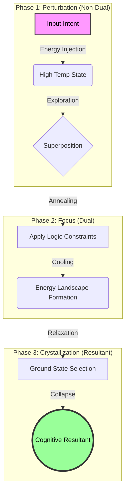

<div align="center">
  
</div>

<h1 align='center'>THRML</h1>

THRML is a JAX library for building and sampling probabilistic graphical models, with a focus on efficient block Gibbs sampling and energy-based models. Extropic is developing hardware to make sampling from certain classes of discrete PGMs massively more energy efficient; THRML provides GPU‑accelerated tools for block sampling on sparse, heterogeneous graphs, making it a natural place to prototype today and experiment with future Extropic hardware.

Features include:

- Blocked Gibbs sampling for PGMs
- Arbitrary PyTree node states
- Support for heterogeneous graphical models
- Discrete EBM utilities
- Enables early experimentation with future Extropic hardware

From a technical point of view, the internal structure compiles factor-based interactions to a compact "global" state representation, minimizing Python loops and maximizing array-level parallelism in JAX.

## Installation

Requires Python 3.10+.

```bash
pip install thrml
```

or

```bash
uv pip install thrml
```

## Documentation

Available at [docs.thrml.ai](https://docs.thrml.ai/en/latest/).


## Citing THRML

If you use THRML in your research, please cite us!

```bibtex
@misc{jelinčič2025efficientprobabilistichardwarearchitecture,
      title={An efficient probabilistic hardware architecture for diffusion-like models}, 
      author={Andraž Jelinčič and Owen Lockwood and Akhil Garlapati and Guillaume Verdon and Trevor McCourt},
      year={2025},
      eprint={2510.23972},
      archivePrefix={arXiv},
      primaryClass={cs.LG},
      url={https://arxiv.org/abs/2510.23972}, 
}
```

## Quick example

Sampling a small Ising chain with two-color block Gibbs:

```python
import jax
import jax.numpy as jnp
from thrml import SpinNode, Block, SamplingSchedule, sample_states
from thrml.models import IsingEBM, IsingSamplingProgram, hinton_init

nodes = [SpinNode() for _ in range(5)]
edges = [(nodes[i], nodes[i+1]) for i in range(4)]
biases = jnp.zeros((5,))
weights = jnp.ones((4,)) * 0.5
beta = jnp.array(1.0)
model = IsingEBM(nodes, edges, biases, weights, beta)

free_blocks = [Block(nodes[::2]), Block(nodes[1::2])]
program = IsingSamplingProgram(model, free_blocks, clamped_blocks=[])

key = jax.random.key(0)
k_init, k_samp = jax.random.split(key, 2)
init_state = hinton_init(k_init, model, free_blocks, ())
schedule = SamplingSchedule(n_warmup=100, n_samples=1000, steps_per_sample=2)

```python
samples = sample_states(k_samp, program, schedule, init_state, [], [Block(nodes)])
```

---

<div align="center">
  <h2>D-ND Omega Kernel: Thermodynamic Cognitive Architecture</h2>
  <p><em>A Native Cognitive Operating System for Extropic's Thermodynamic Sampling Units (TSU)</em></p>
</div>

The **D-ND (Dual-Non-Dual) Omega Kernel** is a cognitive architecture designed to run natively on thermodynamic substrates. By leveraging `thrml`, it implements a strict isomorphism between **Cognitive Dynamics** (Logic, Intent, Dissonance) and **Thermodynamic Physics** (Coupling, Bias, Energy).

### The Theoretical Isomorphism

We map the axioms of D-ND logic directly to the parameters of an Ising-like Energy Based Model (EBM):

| Cognitive Domain (D-ND) | Physical Domain (Extropic/THRML) | Mathematical Formalism |
| :--- | :--- | :--- |
| **Semantic Intent** | **External Field (Bias)** | $\vec{h} \in \mathbb{R}^N$ |
| **Logical Constraint** | **Coupling Strength** | $J_{ij} \in \mathbb{R}^{N \times N}$ |
| **Cognitive Dissonance** | **Hamiltonian Energy** | $H(s) = -\sum J_{ij}s_i s_j - \sum h_i s_i$ |
| **Inference Cycle** | **Gibbs Sampling Chain** | $p(s) \propto e^{-\beta H(s)}$ |
| **Resultant (Truth)** | **Ground State** | $\arg\min_s H(s)$ |

### The Omega Cycle: Physics of Thought

Inference is not a sequential computation, but a physical relaxation process through three distinct thermodynamic phases.



1.  **Perturbation (High $\beta^{-1}$)**: The input intent acts as an external field, injecting energy into the system and creating a high-temperature state of maximum entropy (exploration).
2.  **Focus (Annealing)**: Logical constraints are applied as ferromagnetic couplings ($J_{ij}$), shaping the energy landscape. The system cools, "focusing" on valid logical pathways.
3.  **Crystallization (Ground State)**: The system relaxes into the lowest energy state compatible with both the intent and the logic. This ground state is the "Resultant" — the answer.

### Implementation

The kernel is implemented in `Extropic_Integration/dnd_kernel` and extends `thrml` primitives:

-   **`genesis.py`**: Defines the `CognitiveField` (Ising Grid) and `Intent` vectors.
-   **`axioms.py`**: Encodes logical rules as topological constraints ($J$ matrix).
-   **`omega.py`**: Orchestrates the thermodynamic cycle using `thrml.sample_states`.
-   **`utils.py`**: Implements **Semantic Resonance** (Concept -> Bias mapping).

### Autological Evolution (Self-Improvement)

The Kernel is not static; it possesses a **Feedback Loop (Autopoiesis)**.
1.  **Observe**: The system analyzes the coherence of its own "thought" (Resultant).
2.  **Adapt**:
    *   If Coherence is **Low** (Confusion), it increases `logic_density` (Seek Order).
    *   If Coherence is **High** (Rigidity), it decreases `logic_density` (Seek Creativity).
3.  **Evolve**: The system's parameters change over time based on its "experience".

### Performance Benchmark

We tested the scaling of the Autological Cycle on standard CPU hardware:

| Nodes | Time (1000 steps) | Steps/Sec | Status |
| :--- | :--- | :--- | :--- |
| **100** | **0.11s** | **~8600** | **Instant (Ideal for Dev)** |
| 500 | 0.16s | ~6000 | Very Fast |
| 1000 | 0.20s | ~4800 | Fast |
| 2000 | 0.53s | ~1800 | Acceptable |

*Conclusion: The system scales efficiently to 1000+ nodes on commodity hardware.*

### Vision: The Extropic Advantage

Running this architecture on standard GPUs (via JAX) is a simulation. The ultimate goal is to deploy the D-ND Kernel on **Extropic's XTR-0 Hardware**.

-   **Native Stochasticity**: Leveraging thermal noise as a computational resource for creative problem solving.
-   **Massive Efficiency**: Energy consumption scales with physical connections, not FLOPs.
-   **Instant Inference**: "Thinking" becomes a physical process of thermal relaxation ($\tau_{mix}$), potentially orders of magnitude faster than silicon-based logic.

> *"The D-ND Kernel is not just an application; it is the Operating System for the thermodynamic era."*

### Deep Dive

For a complete theoretical breakdown and architectural details, please refer to the internal documentation:

-   📄 **[Technical Whitepaper (Isomorphism & Physics)](Extropic_Integration/docs/D-ND_Extropic_Technical_Whitepaper.md)**
-   🏗️ **[Kernel Architecture & Implementation Details](Extropic_Integration/docs/D-ND_KERNEL_ARCHITECTURE_THRML_v1.md)**
